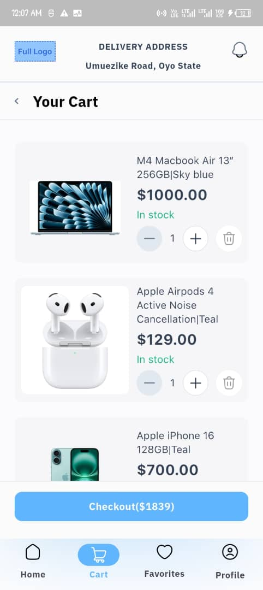

# 🛒 Alphatwelve MiniMart eCommerce App By Jahbuikem Nwazue

An eCommerce app built with Flutter — for the Alphatwelve challenge, it includes product listing, cart management, and a polished UI for showcasing a shopping experience preview.

---

## 🧱 Tech Stack

| Technology     | Usage                              |
|----------------|------------------------------------|
| **Flutter**    | UI framework for cross-platform apps |
| **Dart**       | Primary programming language       |
| **Riverpod**   | State management                   |
| **Custom Widgets** | Modular and reusable UI components |
| **Asset Images** | Product visuals & icons         |

---

## 🚀 Setup Instructions

1. **Clone the Repository**

```bash
git clone https://github.com/Benzzick/minimart_ecommerce_preview_app.git
cd minimart_ecommerce_preview_app
```

2. **Install Dependencies**

```bash
flutter pub get
```

3. **Run the App**

```bash
flutter run
```

> 💡 Make sure a device or emulator is connected.

---

## 🖼️ Screenshots

| Home Screen | Cart Page | Details Page |
|-------------|------------|-------------------|
|  |  |  |

> Screenshots are stored in the `/screenshots` folder..

---

## 📁 Folder Structure Overview

```
lib/
├── core/
│   └── global_providers/
├── features/
│   ├── cart/
│   ├── dashboard/
│   ├── favorites/
│   ├── home/
│   ├── product_details/
│   └── profile/
├── models/
├── shared/
│   ├── widgets/
│   └── utils/
```

---

## ✨ Features

- 🧺 Add/remove/increase/decrease cart items
- 🎨 Consistent color scheme and typography
- 📦 Simple cart logic with total price calculation
- 🪄 Smooth UX with custom buttons and styling
- 📱 Fully responsive layout

---

Thank you Alphatwelve for the challenge!

**Author:** [Jahbuikem Benaiah Nwazue](https://github.com/Benzzick/)

---